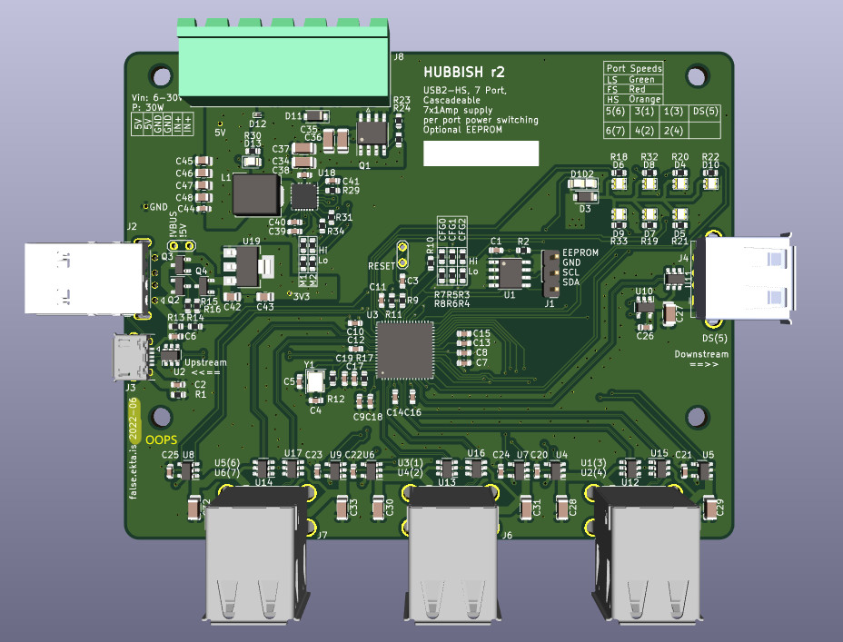
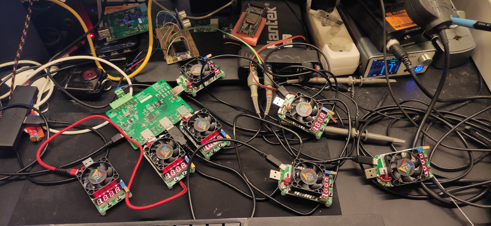
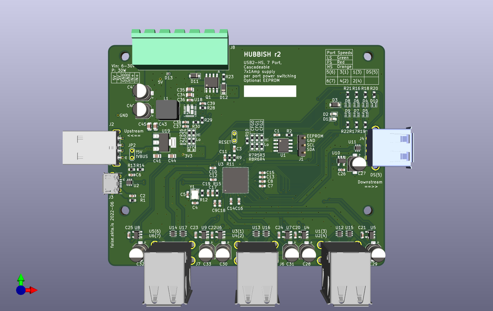
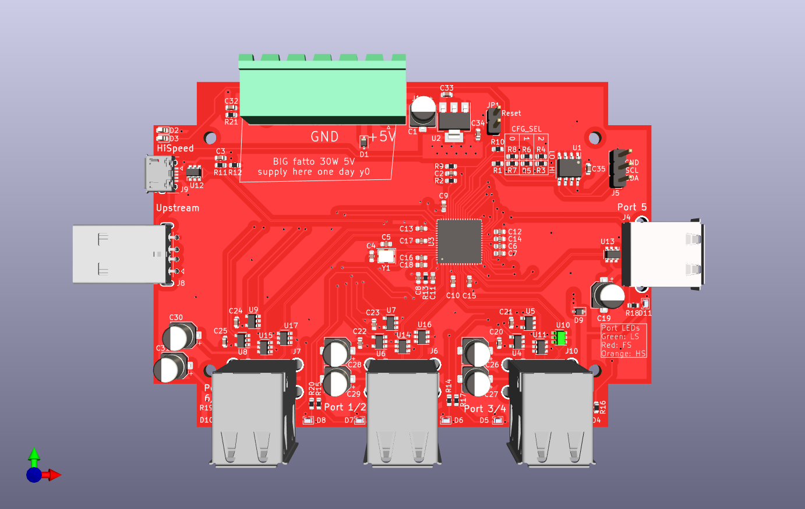

## Hubbish is not rubbish.

Hubbish is a USB 2.0 HS hub.  And?  It has per port power switching and overrcurrent shutoff.
And? It is designed for cascading, with 6 ports for user devices on the front, and ports
on each side for directly plugging together.  And? That's it.

## but why.gif?

Per port power switching was a goal.  Also, "this should be really simple!"
Also, to make the physical layout sensible for the desired use case.  Initially, this
project was conceived to be part of regression testing the USB stack for
[libopencm3](http://www.libopencm3.org).  The _minimal_ test setup there required 17
USB devices.  This is also why the ports are paired.  It's setup to have one port
for the DUT and one for the test driver.  They are otherwise completely independent.

That's all folks!

## Design goals
Cheap as shit, but fully functional. So, cheapest china compatible parts for everything,
but to avoid running into hub depth limits, and make config simpler, still using a
7 port hub, not attempting to cascade 4 port hubs.  Given that the original design goal requires
3 stacked hubs for 18 test ports, caascading hubs internally was not appealing.

Still, doing usb-hs on 2 layers requires fat traces and isolation to do properly, so this
setup is currently targetting jlcpcb's cheap as shit 4 layer 2313 stackup.

Oh, and design it to actually go in a case.

## Origins
This project was split out from the [libopencm3-tests](http://github.com/karlp/libopencm3-tests)
repository when it became apparent that it was it's own monster.

## Versions
### "r4" r2022-12
#### Status
Only on paper, mostly, uses a proper matched pair to "correctly" implement the auto vbus/5v switchiver. (I misunderstood the use of the matched pair, and just used two discrete transistors in overzealous BOM optimization.
TBD: fixes the pwoer good indicator on the main supply as well?
Still need to work on the "local power" portion a bit more fully? (or double check it?)

### "r3" r2022-10
#### Improvements
After a long hiatus, I decided to get back to it, and not even bother assembling the r2 boards I had gotten back.  I had already found some errors, which I can't remember entirely right now, so we just moved forward to r3:
This has a very overhauled BOM, to match JLC's assembly service, rather than just something to assemble myself by hand.
Some footprints change to suit this as well.

#### Status
This was built and assembled by JLC.  It works ok. It doesn't switch between bus powered and self powered very well, iirc.  The hub's "local power" flag isn't handled properly, and that's just my error.  The board still uses optional A-male or B-micro for the upstream USB connection, and "obviously" that should all be PD and type-C these days :)  maybe one day...
Finally, the dual colour leds chosen aren't really very good at showing two colours for low speed / full speed / high speed, particular the difference between FS and HS, which is the more interesting one.  Should revisit that, but I had enough on with this revision to not do more. The "Power Good" LED for the onboard DCDC supply doesn't work properly either, again, my error,  but not really critical.  Finally, the polarity protection FET is only rated to Vgs of 30V.  It's suggested (rightly) that this is really pushing it for a 24V design, and I should look for a better option there.

But, the 40W supply works! This is the biggest DCDC supply I'd ever made myself. (FIXME - add the picture of all the usb load testers plugged in) And not just works, it works and keeps cool, and you can deliver all that power to all 7 downstream ports, up to the limit of each of the load switches.

This design also just decided that programming the EEPROM was the _right_ thing to do, as it also lets you arrange the LEDs nicely to match the ports, and provide proper serial numbers, which are also an important part of a big cascaded port power switching design. [generatei2c.py] is a python script that generates commands for use with i2cutils to program the eeprom via the header.  I used the [i2c_tools example](https://github.com/espressif/esp-idf/tree/master/examples/peripherals/i2c/i2c_tools) on an ESP32 devboard to do this.  It's... very simplistic, but it's enough.

* 
* [Schematic-r3](r2022-10/hubbish-rev3-2022-10.pdf)
* Load testing all ports at once.  (I have thermal images, but have lost them... will have to retest)

### "r2" r2021-03  (lol, finished and ordered 2022-06)
#### Improvements:
Adds a 30-40ish Watt power supply.  Inductor is rated to 9A, regulator to 12A. Per port power switches are
still 1A nominal, so nominally 7x5x1 = 35W for the ports plus around .5x3.3 for the hub itself, or an extra say 2W.

Resizes to 100x80mm so cheaper manufacturing again.  We're no longer trying to find an off the shelf case.
Places like 3d craft cloud have gotten so cheap I'm going to just make a custom case and have it printed on demand.

What's it look like?

* [Schematic-r2](r2021-02/hubbish-rev2.pdf)

#### Bugs
This doesn't have ground connected for two caps on the 3v3 rail, and would have needed some bodge wires, but I seem to recall there being something else, to the point that I decided to not even bother assembling it, and just move on to a rev3, designed for JLC assembly.

### r2020-03
What's it look like?

* [Schematic-r1](r2020-03/usb-test-harness.pdf)

#### Bugs

1. Missing a serial resistor for the crystal.  Doesn't enumerate the hub without it.
1. Needs a jumper wire if yout want to actually run it as a bus powered hub for testing.
1. Port numbers are super wonky.
1. .... doesn't actually work?  I suspect I just have assembly issues, but...
1. Bigger than 100x100, which fits the Bud case nicely, and didn't matter when 4L was always just size based
   but now that jlc is doing 4L super cheap for under 100x100, this can be considered a bug
1. vertical (z axis) positioning of the usptream usb-a-male and downstream usb-a-female for chaining doesn't
   align properly.

